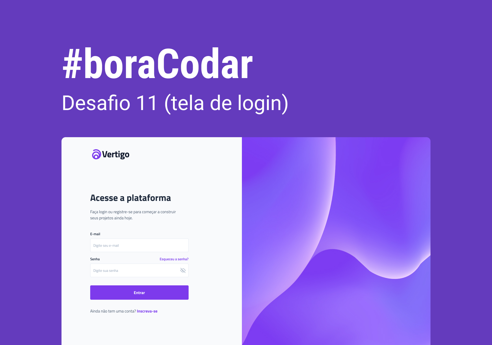
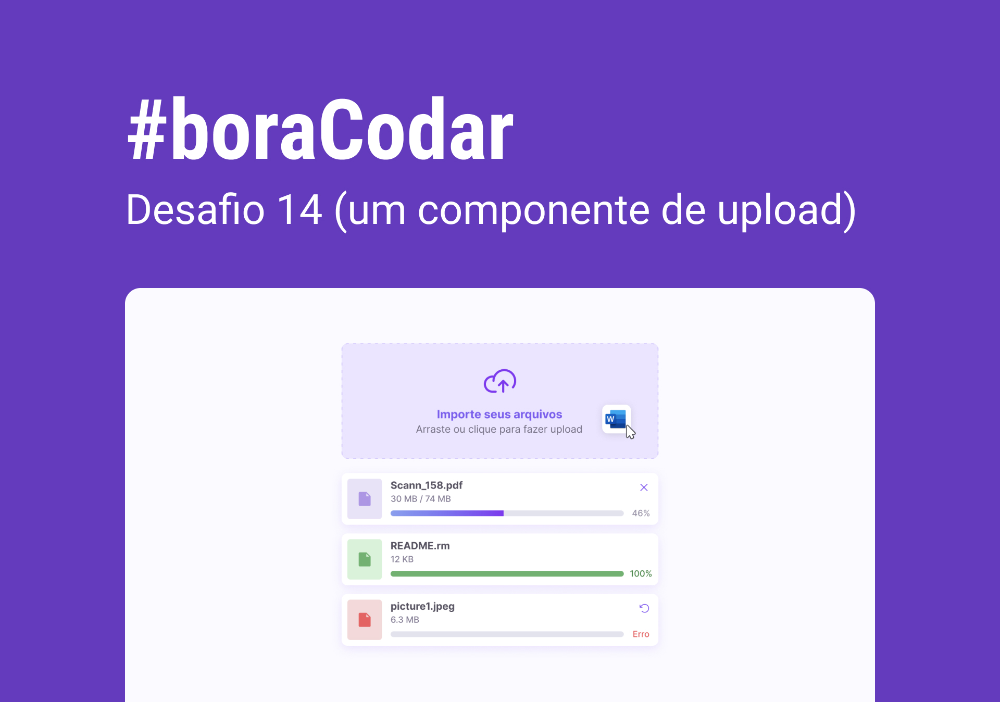

<h1 align="center">#boraCodar</h1>

    Projetos #boraCodar da Rocketseat 
     
     
    <a href="https://lucasregisdemoraes.github.io/boracodar/">Clique aqui para ver a página com todos os desafios concluidos</a>
     
     
    Clique no <strong>nome do projeto</strong> para ver o código
     
    Clique na <strong>imagem do projeto</strong> para ver a página web
     
<table>
    <thead>
        <tr>
            <th align="center">
                 
                

                    <small>#</small>
                

            </th>
            <th align="center">
                 
                
 
                    <small>
                        NAME
                    </small>
                

            </th>
            <th align="center">
                
                
 
                    <small>
                    DESIGN
                    </small>
                

            </th>
            <th align="center">
                
                
 
                    <small>
                    FUNCIONAL
                    </small>
                

            </th>
            <th align="center">
                
                
 
                    <small>
                    PREVIEW
                    </small>
                

            </th>
        </tr>
    </thead>
    <tbody>
        <tr>
            <td>09</td>
            <td><a href="https://github.com/lucasregisdemoraes/boracodar/tree/main/challenges/conversor-de-moedas">Conversor de moedas</a></td>
            <td align="center">✅</td>
            <td align="center">❌</td>
            <td align="center"></td>
        </tr>
        <tr>
            <td>10</td>
            <td><a href="https://github.com/lucasregisdemoraes/boracodar/tree/main/challenges/pagina-de-clima">Página de Clima</a></td>
            <td align="center">✅</td>
            <td align="center">❌</td>
            <td align="center"></td>
        </tr>
        <tr>
            <td>11</td>
            <td><a href="https://github.com/lucasregisdemoraes/boracodar/tree/main/challenges/tela-de-login">Tela de Login</a></td>
            <td align="center">✅</td>
            <td align="center">❌</td>
            <td align="center"></td>
        </tr>
        <tr>
            <td>12</td>
            <td><a href="https://github.com/lucasregisdemoraes/boracodar/tree/main/challenges/kanban">KanBan</a></td>
            <td align="center">✅</td>
            <td align="center">❌</td>
            <td align="center"></td>
        </tr>
        <tr>
            <td>13</td>
            <td><a href="https://github.com/lucasregisdemoraes/boracodar/tree/main/challenges/formulario-de-cartao">Formulário de Cartão</a></td>
            <td align="center">✅</td>
            <td align="center">✅</td>
            <td align="center"></td>
        </tr>
        <tr>
            <td>14</td>
            <td><a href="https://github.com/lucasregisdemoraes/boracodar/tree/main/challenges/componente-de-upload">Componente de Upload</a></td>
            <td align="center">✅</td>
            <td align="center">❌</td>
            <td align="center"></td>
        </tr>
    </tbody>
</table>

