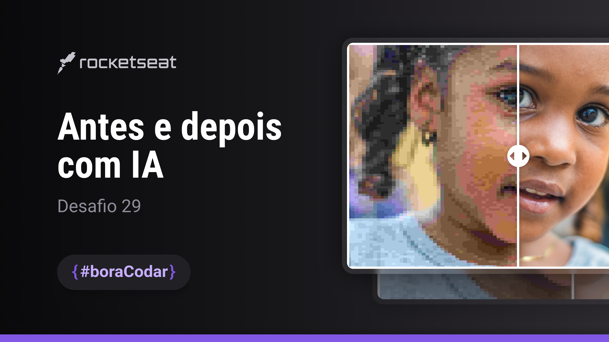

<h1 align="center">Antes e depois com IA</h1>

Desafio #boraCodar 29 da Rocketseat

    <a href="https://lucasregisdemoraes.github.io/boracodar/challenges/antes-e-depois-com-ia">Acesse a página por aqui</a>
     
     
    <a href="https://lucasregisdemoraes.github.io/boracodar">Acesse todos os desafios #BoraCodar concluidos por mim aqui</a>

 

    

## Tecnologias

Esse projeto foi desenvolvido com as seguintes tecnologias:

- HTML e CSS
- SASS (.scss)
- JavaScript
- [Figma](https://www.figma.com)