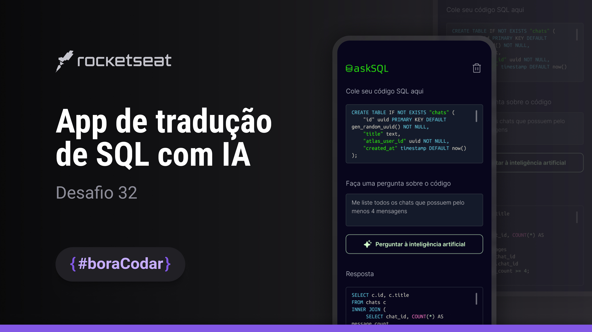

<h1 align="center">App de tradução de SQL com IA</h1>

<p align="center">Desafio #boraCodar 32 da Rocketseat</p>

<p align="center">
    <a href="https://lucasregisdemoraes.github.io/boracodar/challenges/app-de-traducao-de-sql-com-ia">Acesse a página por aqui</a>
    <br>
    <br>
    <a href="https://lucasregisdemoraes.github.io/boracodar">Acesse todos os desafios #BoraCodar concluidos por mim aqui</a>
</p>

<br>

<p align="center">
    
</p>

## Como executar esse projeto

1. Faça o clone [desse repositório](https://github.com/lucasregisdemoraes/app-de-traducao-de-sql-com-ia)
2. Acesse a pasta do projeto
3. Crie um arquivo `.env.local` e coloque a chave da API da OpenAI nesse formato `OPENAI_API_KEY='********'`
4. Instale o projeto com o comando `npm install`
5. Utilize um dos comandos 
```bash
npm run dev
# or
yarn dev
# or
pnpm dev
```
6. Abra `http://localhost:3000` no seu navegador para ver o resultado

## Tecnologias

Esse projeto foi desenvolvido com as seguintes tecnologias:

- NextJS
- TypeScript
- [Figma](https://www.figma.com)
- Icones de lucide-react
- [react-simple-code-editor](https://github.com/react-simple-code-editor/react-simple-code-editor)
- pirsmjs
- useCompletion OpenAI