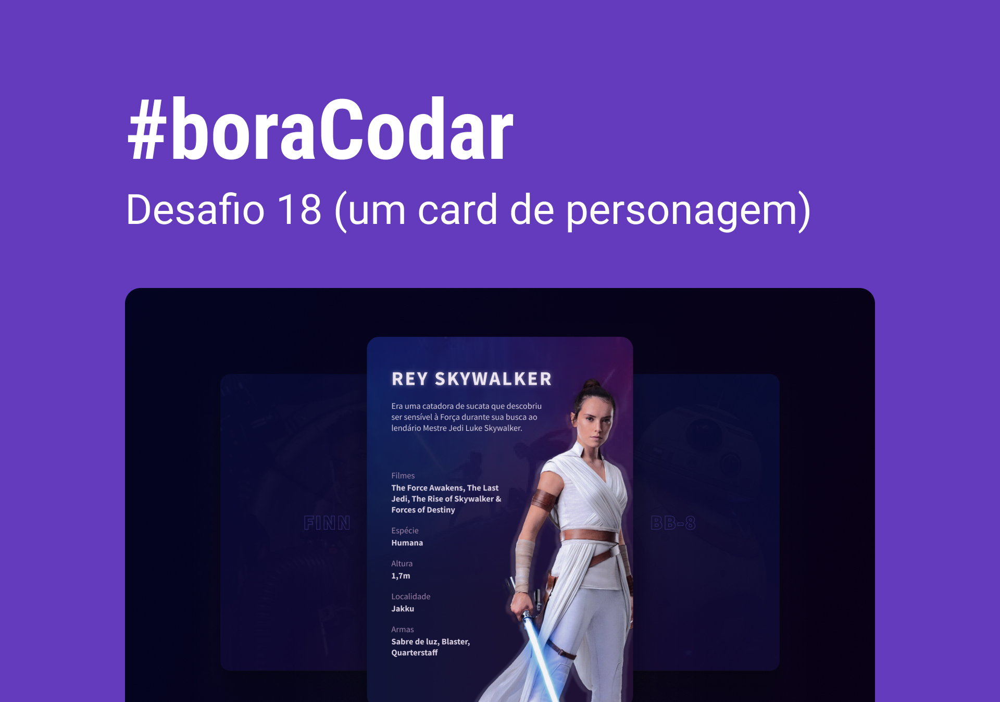

<h1 align="center">Card de Personagem</h1>

Desafio #boraCodar 18 da Rocketseat

    <a href="https://lucasregisdemoraes.github.io/boracodar/challenges/card-de-personagem">Acesse a página por aqui</a>
     
     
    <a href="https://lucasregisdemoraes.github.io/boracodar">Acesse todos os desafios #BoraCodar concluidos por mim aqui</a>

 

    

## Tecnologias

Esse projeto foi desenvolvido com as seguintes tecnologias:

- HTML e CSS
- JavaScript
- [Figma](https://www.figma.com)
- [Atropos JS](https://atroposjs.com/)

## Algumas coisas usadas nesse desafio

- [Atropos JS](https://atroposjs.com/)
- CSS variables
- display flex e grid