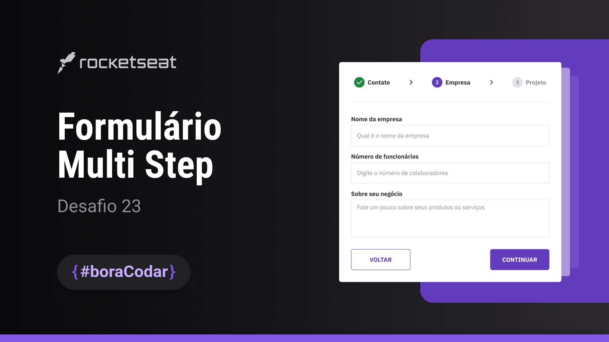

<h1 align="center">Formulário Multi Step</h1>

Desafio #boraCodar 23 da Rocketseat

    <a href="https://lucasregisdemoraes.github.io/boracodar/challenges/formulario-multi-step">Acesse a página por aqui</a>
     
     
    <a href="https://lucasregisdemoraes.github.io/boracodar">Acesse todos os desafios #BoraCodar concluidos por mim aqui</a>

 

    

## Tecnologias

Esse projeto foi desenvolvido com as seguintes tecnologias:

- HTML e CSS
    - @keyframes
- JavaScript
- SASS (.sass)
    - $variables
    - @mixin
- [Figma](https://www.figma.com)
- [Phosphor Icons](https://phosphoricons.com/)