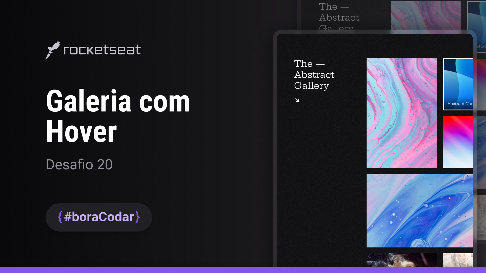

<h1 align="center">Galeria com Hover</h1>

Desafio #boraCodar 20 da Rocketseat

    <a href="https://lucasregisdemoraes.github.io/boracodar/challenges/galeria-com-hover">Acesse a página por aqui</a>
     
     
    <a href="https://lucasregisdemoraes.github.io/boracodar">Acesse todos os desafios #BoraCodar concluidos por mim aqui</a>

 

    

## Tecnologias

Esse projeto foi desenvolvido com as seguintes tecnologias:

- HTML e CSS
- SASS (.sass)
- [Figma](https://www.figma.com)

## Algumas coisas usadas nesse desafio

- [Phosphor Icons](https://phosphoricons.com/)
- [Unsplash Image API](https://unsplash.com)
- responsividade
- CSS variables
- display grid