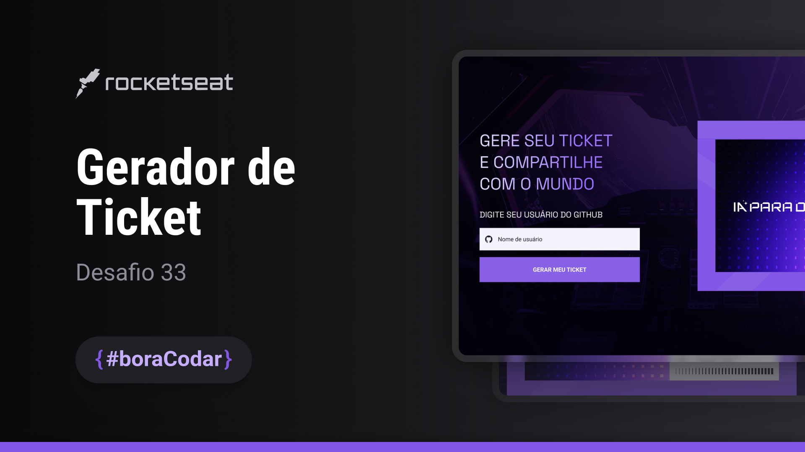

<h1 align="center">Gerador de Ticket</h1>

Desafio #boraCodar 33 da Rocketseat

    <a href="https://lucasregisdemoraes.github.io/boracodar/challenges/gerador-de-ticket">Acesse a página por aqui</a>
     
     
    <a href="https://lucasregisdemoraes.github.io/boracodar">Acesse todos os desafios #BoraCodar concluidos por mim aqui</a>

 

    

## Tecnologias

Esse projeto foi desenvolvido com as seguintes tecnologias:

- HTML e CSS
    - @keyframes
- SASS (.scss)
    - $variable
    - @mixin
- JavaScript
- Github API
- [Figma](https://www.figma.com)
- [Ion Icons](https://ionic.io/ionicons)