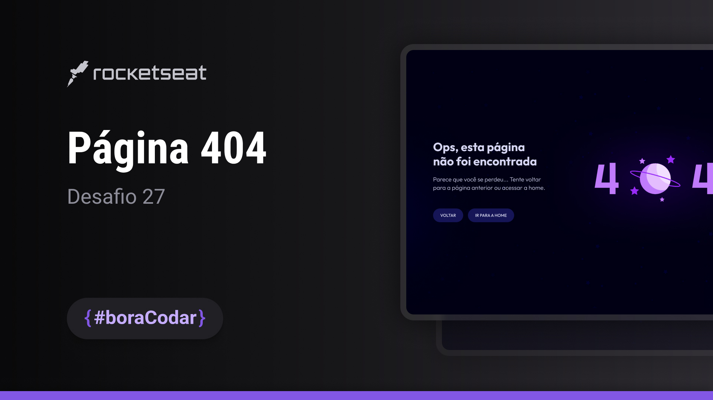

<h1 align="center">Página 404</h1>

Desafio #boraCodar 27 da Rocketseat

    <a href="https://lucasregisdemoraes.github.io/boracodar/challenges/pagina-404">Acesse a página por aqui</a>
     
     
    <a href="https://lucasregisdemoraes.github.io/boracodar">Acesse todos os desafios #BoraCodar concluidos por mim aqui</a>

 

    

## Tecnologias

Esse projeto foi desenvolvido com as seguintes tecnologias:

- HTML e CSS
- SASS (.scss)
    - $variables
- [Figma](https://www.figma.com)
    - Figma for VS Code Extension
- [Lottie Files](https://lottiefiles.com)