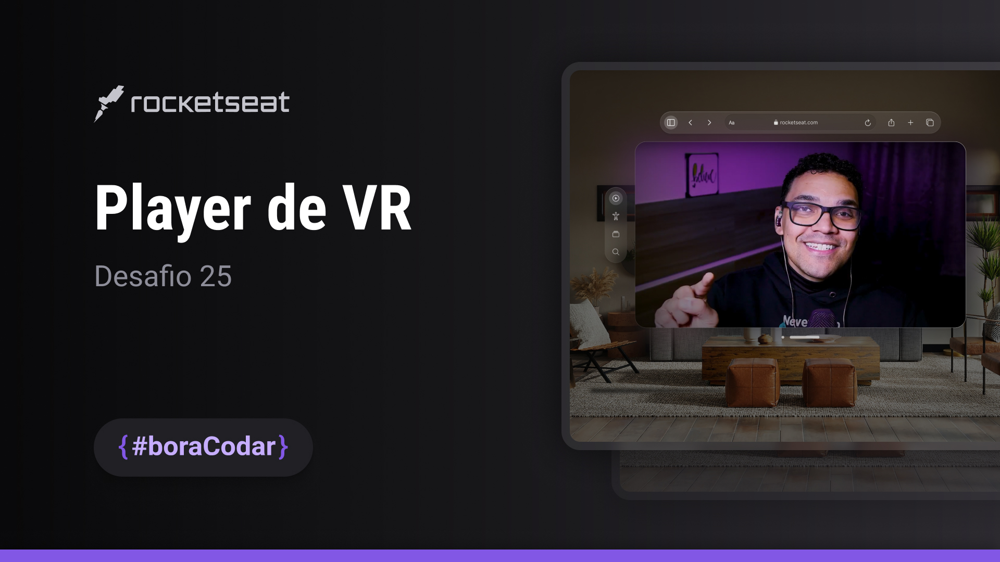

<h1 align="center">Player de VR</h1>

Desafio #boraCodar 25 da Rocketseat

    <a href="https://lucasregisdemoraes.github.io/boracodar/challenges/player-de-vr">Acesse a página por aqui</a>
     
     
    <a href="https://lucasregisdemoraes.github.io/boracodar">Acesse todos os desafios #BoraCodar concluidos por mim aqui</a>

 

    

## Tecnologias

Esse projeto foi desenvolvido com as seguintes tecnologias:

- HTML e CSS
    - @keyframes
- SASS (.sass)
    - $variables
    - @mixin
- JavaScript
- [Figma](https://www.figma.com)
    - Figma for VS Code Extension
- [ion icons](https://ionic.io/ionicons)
- [akar icons](hhttps://akaricons.com/)
- [Video Ambilight](https://brunos3d.github.io/video-ambilight/)