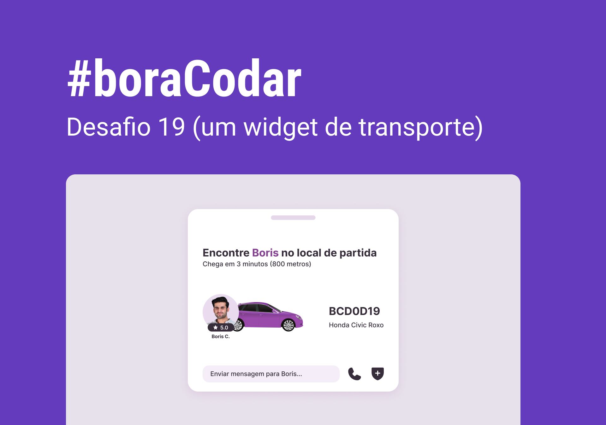

<h1 align="center">Widget de Transporte</h1>

Desafio #boraCodar 19 da Rocketseat

    <a href="https://lucasregisdemoraes.github.io/boracodar/challenges/widget-de-transporte">Acesse a página por aqui</a>
     
     
    <a href="https://lucasregisdemoraes.github.io/boracodar">Acesse todos os desafios #BoraCodar concluidos por mim aqui</a>

 

    

## Tecnologias

Esse projeto foi desenvolvido com as seguintes tecnologias:

- HTML e CSS
- JavaScript
- [Figma](https://figma.com)

## Algumas coisas usadas nesse desafio

- CSS variables
- display flex e grid
- position relative e absolute
- [Phosphor Icons](https://phosphoricons.com/)